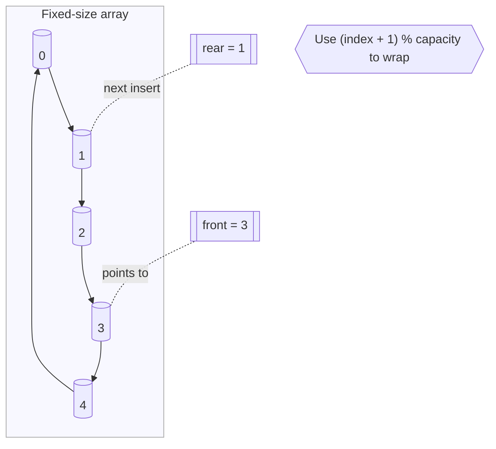
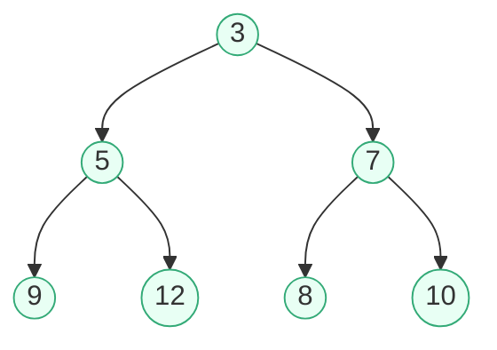
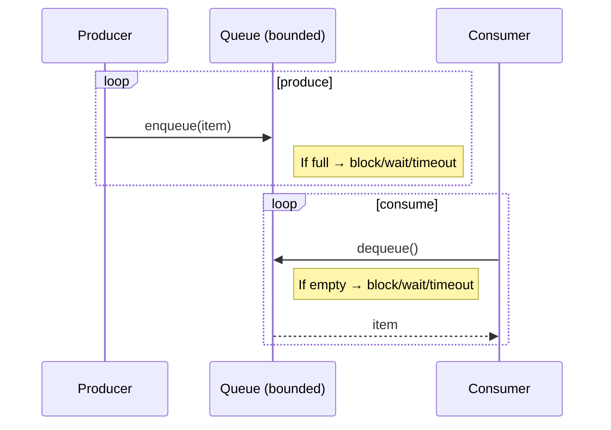

# Queues

FIFO structure for scheduling and buffering.

## Knowledge Points
- [[Core operations: enqueue/dequeue]]
- [[Circular queue and deque]]
- [[Priority queue overview]]
- [[Producer-consumer patterns]]
- [[Queues in OS and networking]]
- [[Array vs linked-list implementation]]
- [[Time/space complexity]]

## Illustrations

### Core operations: enqueue/dequeue (FIFO)
```mermaid
flowchart LR
    subgraph Queue[Queue (FIFO)]
      F((front)) --> N1[1]
      N1 --> N2[2]
      N2 --> N3[3]
      N3 --> R((rear))
    end

    Enq[enqueue(x)] --> R
    F --> Deq[dequeue()]
    note1{{"front returns first-in"}} --- F
    note2{{"rear is insertion point"}} --- R
```

Explanation: Elements are inserted at `rear` with `enqueue`, and removed from `front` with `dequeue`, preserving order.

### Circular queue (array-backed wrap-around)


Two common full/empty strategies:
- Track `size` explicitly.
- Reserve one empty slot and use `(rear + 1) % capacity == front` to denote full.

### Deque (double-ended queue)
```mermaid
flowchart LR
    subgraph Deque
      F((front)) --> X[ ] --> Y[ ] --> Z[ ] --> R((rear))
    end
    pushFront[pushFront(a)] --> F
    pushBack[pushBack(b)] --> R
    F --> popFront[popFront()]
    R --> popBack[popBack()]
```

### Priority queue (binary heap view)


Heap invariant: parent key <= children (min-heap). Insert and extract-min are O(log n).

### Producer-consumer pattern (bounded buffer)


### Queues in OS and networking
```mermaid
flowchart LR
    subgraph NIC[NIC / Router]
      Pkts[Incoming packets] --> Q0[[Queue: Best Effort]]
      Pkts --> Q1[[Queue: Voice (High Pri)]]
      Pkts --> Q2[[Queue: Video (Med Pri)]]
      Scheduler{{WFQ/DRR/PQ Scheduler}} -->|dequeue based on policy| Out((TX))
      Q0 --> Scheduler
      Q1 --> Scheduler
      Q2 --> Scheduler
    end

    subgraph OS[OS Scheduler]
      RQ[[Ready Queue]] --> CPU[(CPU)]
      noteOS{{MLFQ / Aging / Time Slices}} --- RQ
    end
```

### Array vs linked-list queue (shape intuition)
```mermaid
flowchart TB
    subgraph ArrayQueue[Array-backed (circular buffer)]
      A0[( )]-->A1[( )]-->A2[( )]-->A3[( )]-->A4[( )]-->A0
      Ff[[front]] -.-> A2
      Rr[[rear]] -.-> A4
    end

    subgraph LinkedQueue[Linked-list-backed]
      Lf((front)) --> L1(( )) --> L2(( )) --> L3(( )) --> Lr((rear))
    end

    noteA{{Cache-friendly, fixed capacity unless resized}} --- ArrayQueue
    noteL{{Dynamic growth, extra pointers, less locality}} --- LinkedQueue
```

### Time/space complexity (summary)

| Structure | enqueue/push | dequeue/pop | peek/top | space |
|---|---|---|---|---|
| Queue (array/linked) | O(1) amortized / O(1) | O(1) | O(1) | O(n) |
| Deque | O(1) | O(1) | O(1) | O(n) |
| Priority Queue (heap) | O(log n) | O(log n) | O(1) | O(n) |

Tip: For bounded integer priorities, consider bucket queues/radix heaps for near O(1) amortized ops.
